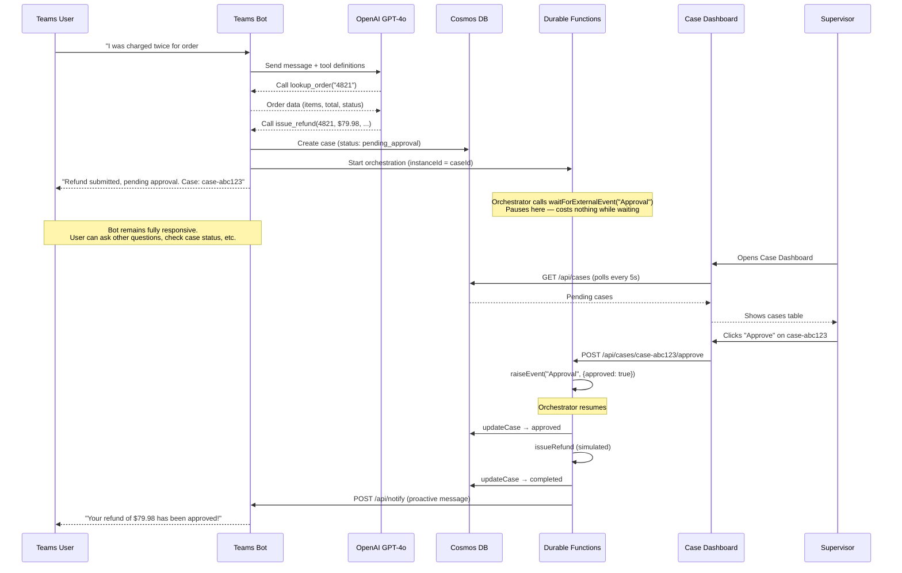

# Durable Support Agent

A Teams bot that acts as an AI-powered support agent for Contoso Electronics. It uses OpenAI function calling to look up orders, search a knowledge base, and issue refunds — with Azure Durable Functions orchestrating a human-in-the-loop approval workflow and Cosmos DB tracking cases.

## Architecture

Three processes work together:

| Process | Port | Role |
|---|---|---|
| **Teams Bot** (Node.js) | 3978 | Handles Teams messages, runs OpenAI tool loop, starts orchestrations |
| **Durable Functions** | 7071 | Runs approval workflow (`waitForExternalEvent`), executes post-approval activities |
| **Supervisor Dashboard** (Next.js) | 3000 | Lists pending cases, approve/reject buttons, polls Cosmos DB |

They communicate via Durable Functions HTTP APIs (start orchestration, raise events) and a shared Cosmos DB container.



## Why Durable Functions?

The core challenge in this sample is: **how do you pause a workflow for hours or days waiting for human approval, without keeping a process running?**

Durable Functions solve this with `waitForExternalEvent` — the orchestration serializes its state and stops executing. When a supervisor approves, `raiseEvent` resumes it from exactly where it left off. Multiple cases from different users wait independently, each in their own orchestration instance.

### Alternatives and their trade-offs

| Approach | How it works | Problems |
|---|---|---|
| **Polling loop** | Bot checks a "pending" flag in a database every N seconds | Wastes compute. Doesn't scale — 1,000 pending cases = 1,000 polling loops. Latency depends on poll interval. |
| **Queue + worker** | Bot writes to a queue; worker picks up after approval | You have to build the state machine yourself: track which step each case is on, handle retries, deal with poison messages. The "wait for approval" step doesn't map naturally to a queue. |
| **Webhook callback** | Bot registers a callback URL; approval service calls it | Bot must be running when the callback arrives (hours/days later). If bot restarts, callback URL may be stale. No built-in retry or state tracking. |
| **Database + cron job** | Store pending cases in DB, cron job checks for approved ones | Same polling problem. Cron frequency = latency floor. Have to manage the state machine in application code. Error handling is manual. |
| **Durable Functions** | `waitForExternalEvent` pauses at zero cost; `raiseEvent` resumes instantly | Requires Azure Functions runtime. Adds a separate process. But: no polling, no state machine code, built-in retry, scales to thousands of concurrent cases. |

Durable Functions are the right fit here because:
- **Zero-cost waiting** — A case pending for 3 days uses no compute until approved
- **Built-in state machine** — The orchestrator code reads like a simple sequential function (`save → wait → process → notify`), but the framework handles checkpointing, replay, and fault tolerance
- **Parallel independence** — Alice's refund and Bob's escalation are separate orchestration instances; approving one has no effect on the other
- **Reliable execution** — If a Functions host crashes mid-orchestration, it replays from the last checkpoint when it restarts

## Tools

The bot registers 6 tools with OpenAI function calling:

| Tool | Description | Needs approval |
|---|---|---|
| `lookup_order(order_id)` | Returns order details from mock data | No |
| `lookup_customer(email)` | Returns customer profile from mock data | No |
| `search_knowledge_base(query)` | Keyword search over support articles | No |
| `check_case_status(case_id)` | Queries Cosmos DB for case status | No |
| `issue_refund(order_id, amount, reason, email)` | Creates case + starts Durable orchestration | Yes |
| `escalate_to_human(reason, priority)` | Creates escalation case + starts orchestration | Yes |

## Prerequisites

- Node.js 20+
- Azure CLI (`az`) — logged in with `az login`
- Azure Functions Core Tools (`npm install -g azure-functions-core-tools@4`)
- Azurite storage emulator (`npm install -g azurite`)
- An OpenAI API key

## Setup

### 1. Provision Cosmos DB

```bash
cd Samples/durable-support-agent
./scripts/setup.sh
```

This creates a serverless Cosmos DB account with database `support-agent` and container `cases`. The script prints the connection string — add it to all three config files:

- `.env` → `COSMOS_CONNECTION_STRING=...`
- `functions/local.settings.json` → `Values.COSMOS_CONNECTION_STRING`
- `dashboard/.env.local` → `COSMOS_CONNECTION_STRING=...`

### 2. Start Azurite (storage emulator for Durable Functions)

```bash
azurite --silent --location /tmp/azurite
```

### 3. Start Durable Functions (Terminal 1)

```bash
cd functions
npm install
npm run dev
```

You should see 7 functions registered (3 HTTP + 3 activities + 1 orchestrator).

### 4. Start Teams Bot (Terminal 2)

```bash
npm install
npm run dev
```

Bot listens on port 3978, notification endpoint on 3979, devtools at 3981.

### 5. Start Supervisor Dashboard (Terminal 3)

```bash
cd dashboard
npm install
npm run dev
```

Dashboard at http://localhost:3000.

### 6. Start dev tunnel (Terminal 4, for Teams)

```bash
devtunnel host -p 3978
```

### 7. Test

For quick local testing without Teams, use the devtools UI at http://localhost:3981/devtools.

## Project Structure

```
durable-support-agent/
├── src/
│   ├── index.ts              # Bot entry point — message handler, notify endpoint
│   ├── types.ts              # SupportCase, Order, Customer interfaces
│   ├── cosmos.ts             # Cosmos DB client (init, CRUD, query)
│   ├── knowledge-base.ts     # Loads markdown KB, keyword search
│   └── tools.ts              # 6 OpenAI function-calling tools
├── data/
│   ├── knowledge-base.md     # Contoso Electronics support articles
│   ├── mock-orders.json      # Sample order data
│   └── mock-customers.json   # Sample customer data
├── functions/
│   ├── src/
│   │   ├── index.ts          # Registers orchestrator, activities, HTTP endpoints
│   │   ├── orchestrator.ts   # Approval workflow with waitForExternalEvent
│   │   └── activities.ts     # updateCase, issueRefund, notifyBot
│   ├── host.json             # Durable task hub config
│   └── local.settings.json   # Local dev settings
├── dashboard/
│   └── src/app/
│       ├── page.tsx           # Pending cases table, auto-refresh, approve/reject
│       ├── layout.tsx         # Root layout
│       └── api/cases/
│           ├── route.ts       # GET pending cases from Cosmos
│           └── [id]/
│               ├── approve/route.ts  # POST → raise Durable event (approved)
│               └── reject/route.ts   # POST → raise Durable event (rejected)
├── scripts/
│   └── setup.sh              # Cosmos DB provisioning (az CLI)
├── appPackage/                # Teams app manifest
└── package.json
```

## Teardown

```bash
./scripts/setup.sh --delete
```
